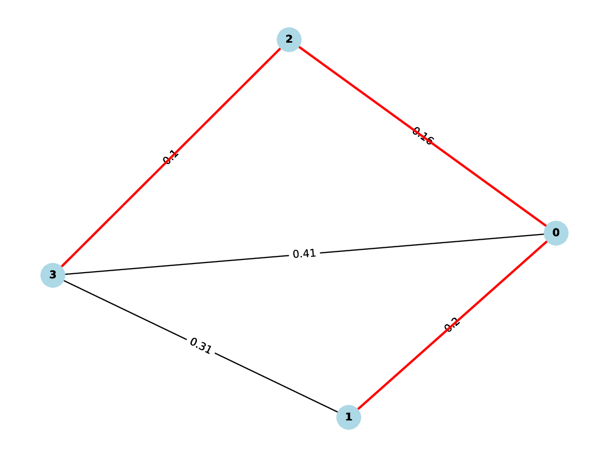
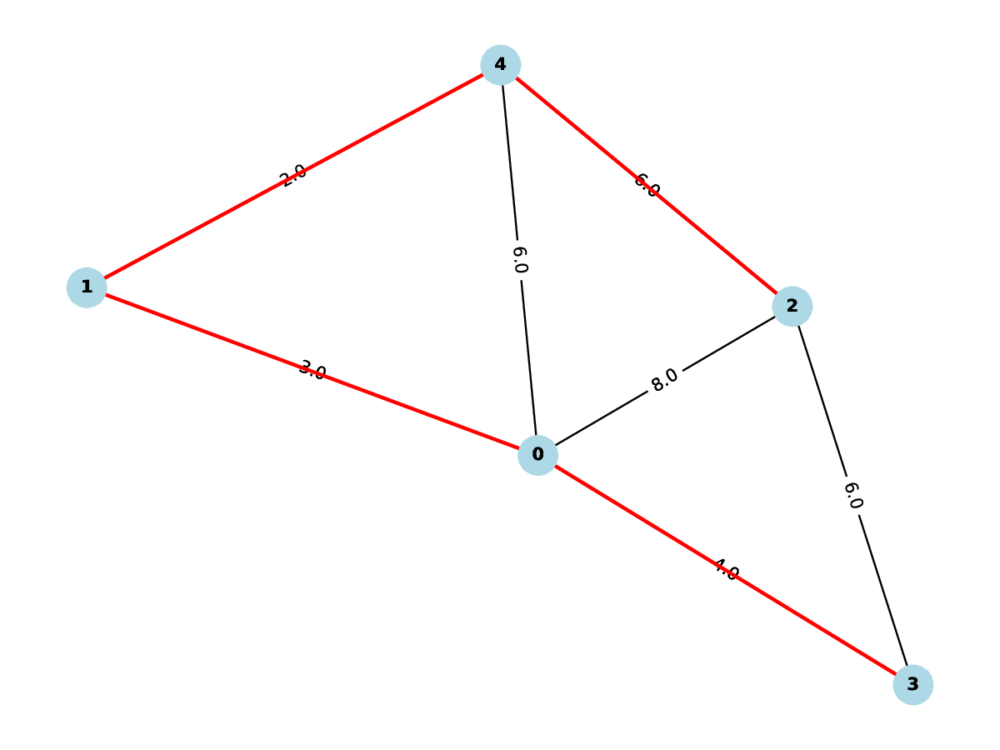
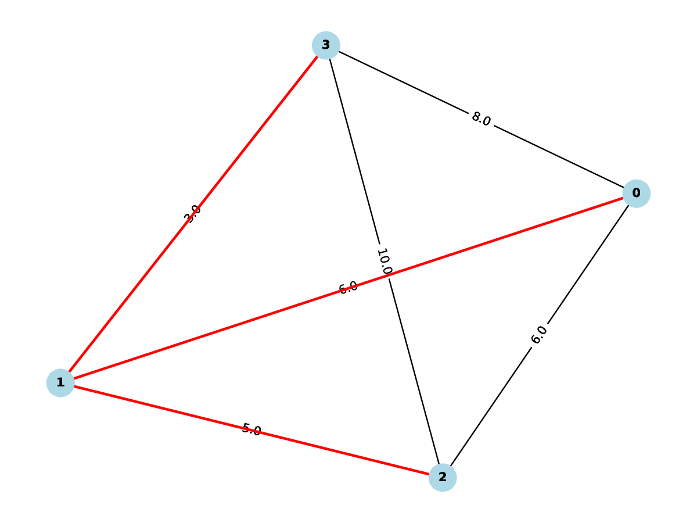
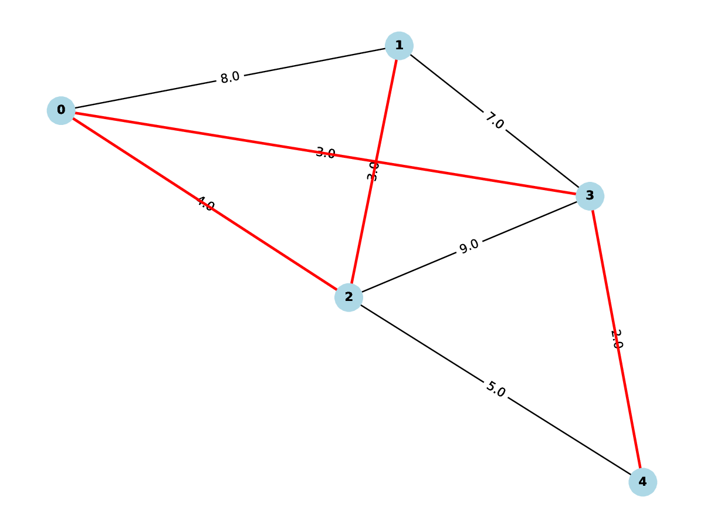
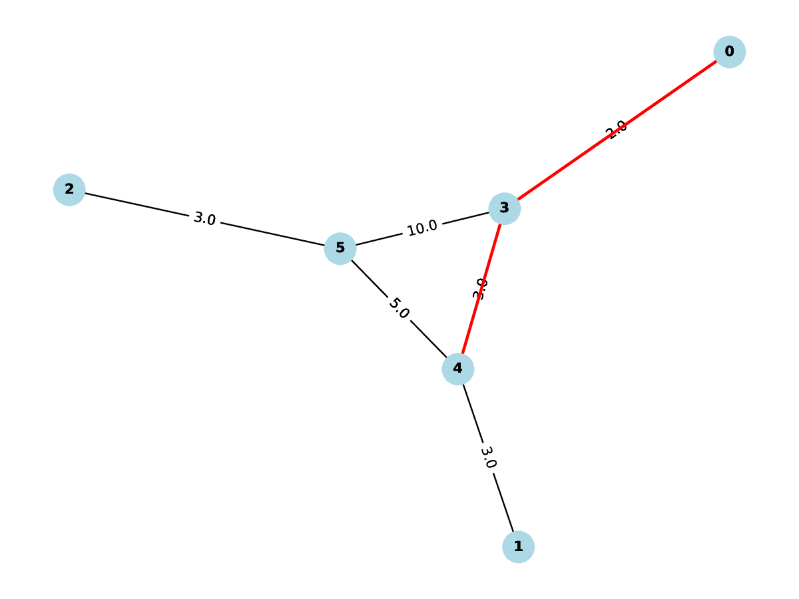
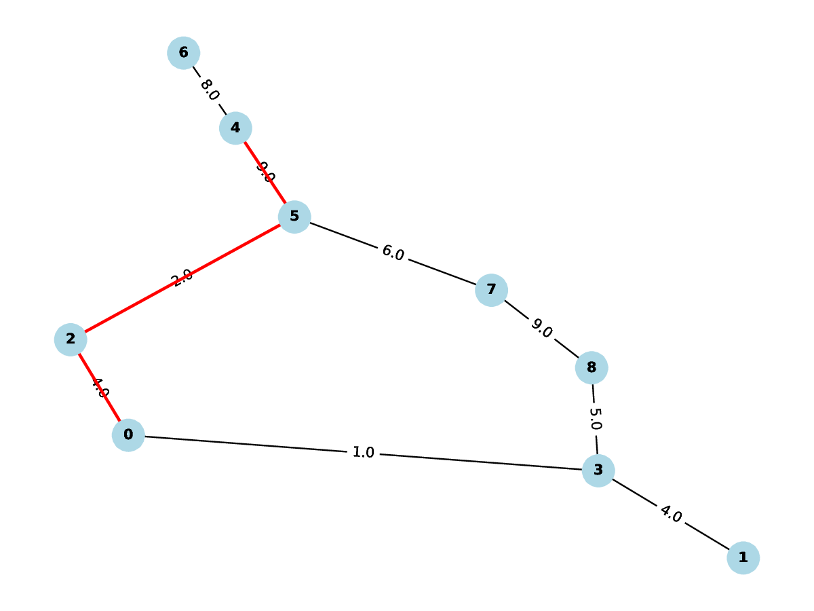

# x7
### Exercises
- Question 4 is found in x7/x7.pdf
- Question 5,8 and 14 are inside x7 directory
- Question 7 is the first graph in the graphs variable of kruskal.py.
```bash
cd x7
```
### Generate graphs
- This will generate file with MST graphs, declare number of nodes and probability of connection. 
- Example:
```bash
python main.py 5 0.7 randomGraph.pdf
```
## Prim's 
### Run
```bash
python3 prims.py
```



## Kruskals
### Run
```bash
python3 kruskals.py
```



## Dijkstra 
### Run
```bash
python3 dijkstra.py
```


